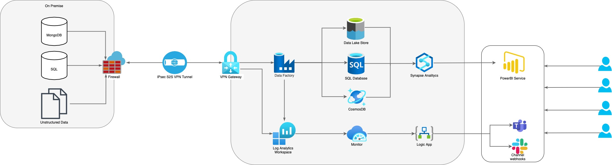

# Data Engineering
This document describes the reasoning behind my design choices and technical step required to deploy the IaC (terraform) I have written.

## Assignment
I was offered the option between assignments for two different positions, Public Cloud Engineer & Data Engineer. Due to my background and personal preference leaning more towards data and software engineering, I have chosen the Data Engineering Assignment. As my background is more focused on software development there are some concepts that are new to me and require some research from my part.

## Key Meeting Points
1. Data
  - Structured data from MS-SQL Server & MongoDB
  - Unstructured data, source unknown?
  - More data sources later
2. ETL
  - Preference for PaaS Solution
  - Some unstructured data needs to be normalized
3. Required Tools
  - Analysis Tool
  - Visualization Tool (PowerBI)
  - Machine Learning reading data
4. Architecture
  - Keep costs in control
  - Enterprise Big Data (Scalability)
5. Networking
  - ExpressRoute or VPN (Security)
  - Network activity logging
6. Additional
  - CI/CD tool for ETL & Infrastructure
  - GIT Repos

## My Interpretation
The customer wants to make decisions from their data. There is no exact specification what type of business decisions, nor the exact amount of data. This points to the requirement for a solid foundation to develop current and new ideas on. The solution will need to process data from multiple sources and source types and scale to an enterprise level. The customer expressed a clear preference for PaaS solutions.
There is a requirement for a secure network connection to the Public Cloud which points to (some) data residing on premise. All network activity needs to be logged, but there is no requirement for creating alerts based of this logging yet.
Change to the ETL pipelines and infrastructure should be done through a CI/CD pipeline.

## Public Cloud Choice
I have chosen Azure as the public cloud to deliver this solution on. Azure offers all PaaS services which are found in the customer requirements. I have more experience in Azure Services than any other public cloud and IaC (Terraform & ARM).

## Azure Services Choice
1. Data Storage
  - Azure SQL Server
  - Azure CosmosDB
  - Azure Data Lake Gen2
  - Azure Storage Account
2. ETL
  - Azure Data Factory
3. Analysis
  - Azure Synapse Analytics
4. Visualization
  - PowerBI
5. Networking
  - Azure VPN Gateway
6. Logging
  - Azure Log Analytics
7. Additional Tools 
  - Azure DevOps (CI/CD)
  - Azure Monitor (Alerts)
  - Azure Key Vault (Security)
  - Optional: Azure Logic Apps (Integration)

## Design

## Azure DevOps
Azure DevOps will be used to store all code and Infrastructure as Code (IaC). Azure DevOps will also allow the development of build pipelines, artifacts and release pipelines. This will be one tool which will offer all required CI/CD tools for multiple people (and teams) to work on the Data Platform.

### Network
Due to no specification of the current on-premise location I have assumed the current datacenter does not have options for Azure ExpressRoute. 
I have chosen to setup a site to site (S2S) VPN using a Azure VPN Gateway, this will save us migrating to a datacenter which ofefers ExpressRoute. This will offer the required level of security for the customers data. This will require some on-premise network configuration. This might require a network engineer if there is limited access to on premise network configuration.

### ETL
For the ETL process a Azure Data Factory will be implemented. Azure Data Factory is a PaaS platform which offers several out of the box connectors and actions. This will limit the requirement to develop a lot of code, but if required Azure Data Factory allows for custom code or use of other Azure services. Azure Data Factory allows for storing pipelines in a GIT repository and maintaining them with CI/CD. Azure Data Factory will also scale to the customers enterprise (Big Data) requirement.

### Storage
Due to the unclear requirement of data storage, apart from the big data requirement, i have allowed for several options to be chosen from. My preference would go to a Azure SQL Datawarehouse. Although modeling this into facts and dimensions is beyond my personal knowledge, this would require a more experienced Data Engineer.
I have left the option for other storage options open such as Azure Data Lake Gen2 and Azure CosomosDB (NoSQL).

### Analysis
Azure Synapse Analytics is a diverse analysis PaaS solution which can query data from different sources. Azure Synapse Analytics can scale to execute enterprise big data queries and retain performance. If analytical queries need to be designed to make meaningful business decisions, a Data Analyst might be required. Azure Synapse Analytics also integrates with PowerBI for seamless visualization design. 
Azure Synapse Analytics also offers Machine Learning integration as specified by the customer. For the development and use of Machine Learning models an AI engineer and/or Data Scientist might be required.

### Visualization
PowerBI Service will allow for building reports and dashboards from the data offered by Azure Synapse Analytics. These reports can show data in a meaningful way to make BI decisions from.

### Logging
Azure Log Analytics allows for storing metrics from multiple Azure services. These metrics can be queried to create Alerts based on the customer requirement. This could alert engineers of a failed ETL pipeline or unwanted network activity. These Alerts can be created in Azure Monitor and could be send to a slack channel, teams channel and create a Service Management Incident in an Service Management tool (through use of Azure Integration Services).

## Additional Expertise
- Network engineers (On premise)
- Additional Data Engineer with Datawarehouse Modeling Experience.
- Data Analyst (Analysis & Visualization)
- AI Engineer and/or Data Scientist

## Getting Started
1. Setup A Azure DevOps Organization and Project to store code (GIT) and Run Pipelines
2. For (initial) infrastructure deployment read the terraform [readme.md](tf-resources/readme.md)

## Sample.xlsx
I would advise on creating a pipeline in Data Factory for moving the data into a database (SQL). This will allow for a reusable ETL proces for similar files in teh future. This also remove a part of the complexity of writing only code.

## Time
I spend a fair amount of time researching data models and concepts to have a better understanding of the requirements and what would be best for the customer. Here is a short overview of roughly the amount of time is spent on this project.

| Task                | Time |
|---------------------|------|
| Distil Requirements | 0:30 |
| Determine Services  | 1:00 |
| Write Reasoning     | 1:00 |
| Initial Terraform   | 2:00 |
| Merge Terraform     | 1:00 |
| Terraform Manual    | 1:00 |
| Research            | 2:00 |
| Grand Total         | 8:30 |